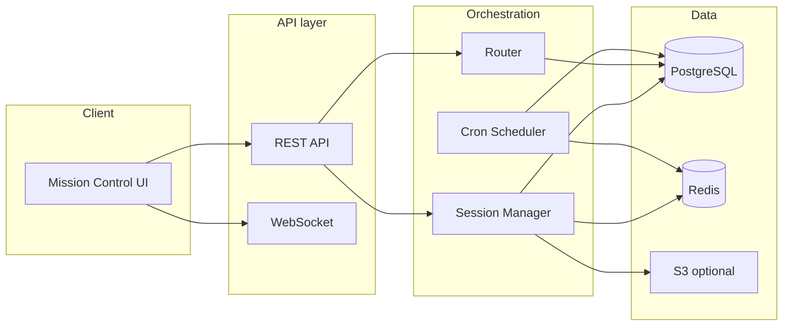

# OpenClaw deep dive and how we're building SquidJob.com

**Awit Media Private Limited** · **SquidJob.com**

This document explains how OpenClaw works and how its agents operate, then maps those concepts to how SquidJob.com is planned to be built—what we adopt, what we change for multi-tenant SaaS, and how the implementation aligns with our architecture docs.

---

## Part 1: How OpenClaw works

### 1.1 What OpenClaw is

OpenClaw is a **local-first, personal AI agent platform** (not a generic "framework"). It is open-source, self-hosted, and runs on the user's machine. It connects to many messaging channels (WhatsApp, Telegram, Discord, Slack, Signal, iMessage, 29+ protocols) and provides one autonomous AI assistant that can use tools and remember context.

- **Single embedded agent runtime** derived from **pi-mono** (models/tools); session management, discovery, and tool wiring are OpenClaw's own.
- **Model-agnostic**: works with Claude, GPT, DeepSeek, or local models via API keys.
- **Node.js**-based with native async; 100+ "AgentSkills" (preconfigured automations).

### 1.2 Core architecture: the Gateway

The **Gateway** is the central control plane:

- **Single TypeScript process** (default: `ws://127.0.0.1:18789`, localhost-only).
- **Owns** session state, transcripts, and lifecycle.
- **Manages**: channel connections, routing messages to sessions, coordination with LLMs, control UI.
- **Execution loop**: receive → route → (context + LLM + tools) → stream → persist.
- **Per-conversation queue**: each chat has its own execution lane so one slow conversation doesn't block others.

So in OpenClaw, "how it works" = one Gateway daemon + one agent runtime + file-based workspace + channel adapters.

### 1.3 Workspace and bootstrap files (how agents get their "brain")

The agent has **one workspace directory** (e.g. `~/.openclaw/` or `agents.defaults.workspace`). That directory is the agent's only working directory (cwd) for tools and context.

**Bootstrap files** (user-editable, injected into context on first turn of a new session):

| File             | Purpose                                                    |
| ---------------- | ---------------------------------------------------------- |
| **USER.md**      | User profile and preferred address                         |
| **IDENTITY.md**  | Agent name, vibe, emoji                                    |
| **SOUL.md**      | Persona, boundaries, tone (programmable "soul")            |
| **AGENTS.md**    | Operating instructions and "memory"                        |
| **TOOLS.md**     | Tool-usage guidance (not which tools exist; that's config) |
| **BOOTSTRAP.md** | One-time first-run ritual (deleted after completion)       |

- Blank files are skipped; large files are trimmed with a marker.
- Missing file → single "missing file" marker; `openclaw setup` can create default templates.
- **Skills** load from workspace `/skills`, `~/.openclaw/skills`, and bundled skills; config can gate them.

So **how OpenClaw agents work** = one runtime that, each session, reads these Markdown files and injects them into the LLM context, then runs the receive → LLM + tools → stream → persist cycle.

### 1.4 Sessions and persistence

- **Session transcripts**: JSONL under `~/.openclaw/agents/<id>/sessions/<sessionId>.jsonl`.
- Session ID is stable, chosen by OpenClaw.
- **No cloud**: everything is local, single-user, filesystem-based.

### 1.5 Heartbeat (autonomy without user prompts)

- **Periodic agent turns** in the main session (e.g. every 30m or 1h).
- **HEARTBEAT.md** in the workspace: checklist the agent reads each heartbeat.
- Default instruction: read HEARTBEAT.md, follow it strictly; if nothing needs attention, reply **HEARTBEAT_OK** (OpenClaw then drops that message).
- Optional: active hours, reasoning delivery, target channel (`target: "last"`).
- Use cases: email triage, GitHub checks, news, alerts.

So OpenClaw agents "work" by: **file-based identity (SOUL/AGENTS/TOOLS) + session JSONL + periodic heartbeat reading HEARTBEAT.md**.

### 1.6 Mission Control (multi-agent squad on top of OpenClaw)

**Mission Control** is a viral pattern (e.g. Bhanu Teja P's setup), not part of core OpenClaw:

- **10 autonomous agents** + one lead ("Jarvis") coordinating.
- **Shared task management**: agents create, claim, execute, review tasks.
- **Inter-agent communication**: threads, group chats, escalation to Jarvis.
- **24/7**, self-organizing.

To run Mission Control you add:

- A **shared database** (e.g. Convex) for tasks and state.
- A **dashboard** (Kanban, activity).
- **Cron/scheduling** and **custom agent-to-agent comms**.

Known issues when run without guardrails (from community and posts like Clawctl's analysis):

- **Cost**: 10 agents × many LLM calls → bills 10–50x higher than expected.
- **Quality drift**: errors compound, circular agreement, no human correction.
- **Single point of failure**: lead agent (Jarvis) can lead the squad astray.
- **No audit trail, no sandboxing, no cost caps, no kill switch** in the basic OSS setup.

SquidJob.com's product spec explicitly adopts the Mission Control *concept* (10-agent squad, Kanban, standups, shared DB) and adds production guardrails (BYOK, quotas, RLS, audit, sandboxing). In SquidJob.com, **Kaustubh - Founder** is the human tenant owner label, and the default squad lead agent is **Oracle (Squad Lead)**.

---

## Part 2: How we're planning to build SquidJob.com

The following maps OpenClaw/Mission Control concepts to our architecture (as in [Awit Architecture Draft.md](Awit%20Architecture%20Draft.md) and [Architecture-NodeJS-PostgreSQL.md](Architecture-NodeJS-PostgreSQL.md)).

### 2.1 What we adopt from OpenClaw

| OpenClaw concept                    | SquidJob.com implementation                                                                                                                                                                                   |
| ----------------------------------- | ------------------------------------------------------------------------------------------------------------------------------------------------------------------------------------------------------------- |
| **Gateway as central orchestrator** | **Agent Orchestration Engine** (Node.js): Session Manager, Router, Cron Scheduler; same "receive → context + LLM + tools → persist → route" idea, multi-tenant.                                               |
| **SOUL.md / AGENTS.md / TOOLS.md**  | Stored in DB per agent: `agents.soul_md`, `agents_md`, `tools_md`; injected into context each turn (same role as bootstrap files).                                                                            |
| **HEARTBEAT.md**                    | `agents.heartbeat_md`; heartbeat turns read it; reply `HEARTBEAT_OK` → silent consume (same semantics).                                                                                                       |
| **Session as unit of state**        | Session Manager + composite key `tenant:agent:context`; conversation buffer, compaction summary, token count (same idea; storage is Redis + PostgreSQL, not filesystem).                                      |
| **Pre-compaction memory flush**     | Auto-compaction protocol: before summarizing old context, silent agentic turn writes durable insights to long-term memory (explicitly "direct adaptation of OpenClaw's pre-compaction memory flush pattern"). |
| **Heartbeat interval**              | Configurable per tenant; default 15 min; staggered by `heartbeat_interval / agent_count` to avoid thundering herd.                                                                                            |
| **Cron / scheduled jobs**           | Cron Scheduler; jobs in DB (`cron_jobs`); main-session vs isolated execution (OpenClaw-style main session vs fresh session per run).                                                                          |

So: **same agent "anatomy" (SOUL, AGENTS, TOOLS, HEARTBEAT, session, compaction)**; we move from single-machine, file-based, single-user to **cloud, DB-backed, multi-tenant**.

### 2.2 What we change for multi-tenant SaaS

| Dimension              | OpenClaw                               | SquidJob.com                                                                                                                             |
| ---------------------- | -------------------------------------- | ---------------------------------------------------------------------------------------------------------------------------------------- |
| **Tenancy**            | Single user, one workspace             | Multi-tenant; every table has `tenant_id`; RLS; JWT carries tenant.                                                                      |
| **Persistence**        | Local JSONL + files                    | PostgreSQL (warm/cold session, tasks, agents, memory_entries); Redis (hot session); optional S3 (deliverables, cold archive).            |
| **Identity/config**    | Files in one workspace                 | Rows in `agents` (and related); SOUL/AGENTS/TOOLS/HEARTBEAT as text columns.                                                             |
| **Scheduling**         | Gateway cron, file-based               | Cron and heartbeats in DB; Node.js worker (e.g. Bull/BullMQ) or pg_cron; distributed lock (Redis SETNX).                                 |
| **Real-time**          | Local Gateway                          | REST + WebSocket; backend uses PostgreSQL `LISTEN/NOTIFY` and pushes to clients (no Convex required).                                    |
| **API keys**           | User's own keys in config              | **BYOK**: encrypted in DB (envelope encryption); never log or expose plaintext; per-tenant.                                              |
| **Mission Control UI** | Custom build (e.g. Convex + dashboard) | First-class: Mission Control UI (Dashboard, Kanban, Agent Roster, Standup View); React + Vite + Tailwind; talks to Node API + WebSocket. |
| **Guardrails**         | Largely DIY                            | Cost/usage tracking, per-tenant quotas, sandboxing (Docker → gVisor → Firecracker by tier), audit log, RBAC.                             |

### 2.3 High-level build plan (from our architecture docs)

- **API service** (Node.js, Express/Fastify): REST for agents, tasks, standups, activity, config, webhooks; WebSocket for real-time; auth and tenant from JWT; set `app.tenant_id` for RLS.
- **Orchestration service** (Node.js): Session Manager (load/save session from Redis + PG), Router (dispatch tasks to agents), Cron Scheduler (due jobs from `cron_jobs`, heartbeats); run agent loop: load context (SOUL + memory + task) → LLM (customer's key) → tools (sandboxed) → persist.
- **DB**: PostgreSQL with pgvector for `memory_entries`; full schema in [Architecture-NodeJS-PostgreSQL.md](Architecture-NodeJS-PostgreSQL.md) (tenants, users, api_keys, agents, tasks, comments, activities, sessions, memory_entries, deliverables, cron_jobs, usage_records, notifications, standups, audit_log).
- **Memory**: Same four-tier idea (SOUL, long-term, working, daily notes); retrieval via hybrid search (BM25-style + pgvector + rerank) to limit token use (QMD-inspired in the product spec).

### 2.4 Guardrails we explicitly add (vs raw Mission Control)

From the product spec and architecture:

- **BYOK + encryption**: API keys never stored or logged in plaintext; envelope encryption; optional customer-managed vault at enterprise.
- **Per-tenant isolation**: RLS, tenant in JWT only; no tenant in path/query.
- **Usage and cost**: `usage_records` and cost dashboard; heartbeat/cron can use cheaper models and small HEARTBEAT.md to control cost.
- **Audit**: Append-only `audit_log` for sensitive actions.
- **Sandboxing**: By tier (Starter: hardened containers; Pro: gVisor; Enterprise: Firecracker).
- **Daily standups**: Cron-triggered aggregation so humans see what the squad did (accountability and "grounding to reality").
- **Rate limits and quotas**: Per tenant/plan to avoid runaway usage.

---

## Summary

- **OpenClaw**: Single Gateway daemon + single agent runtime (pi-mono–derived), file-based workspace (SOUL.md, AGENTS.md, TOOLS.md, HEARTBEAT.md), session JSONL, heartbeat for autonomy; local, single-user.
- **Mission Control**: Pattern of 10+ agents + shared DB + dashboard + inter-agent tasks/comms; powerful but needs guardrails (cost, quality, audit, sandbox).
- **SquidJob.com (our plan)**: Keeps OpenClaw's agent model (SOUL/AGENTS/TOOLS/HEARTBEAT, session, compaction with memory flush) and Mission Control's product idea (squad, Kanban, standups), then builds it as a **multi-tenant SaaS** on **Node.js + PostgreSQL + Redis** with **BYOK, RLS, audit, sandboxing, and cost controls** as in [Awit Architecture Draft.md](Awit%20Architecture%20Draft.md) and [Architecture-NodeJS-PostgreSQL.md](Architecture-NodeJS-PostgreSQL.md).
